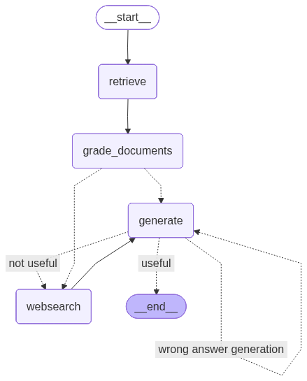
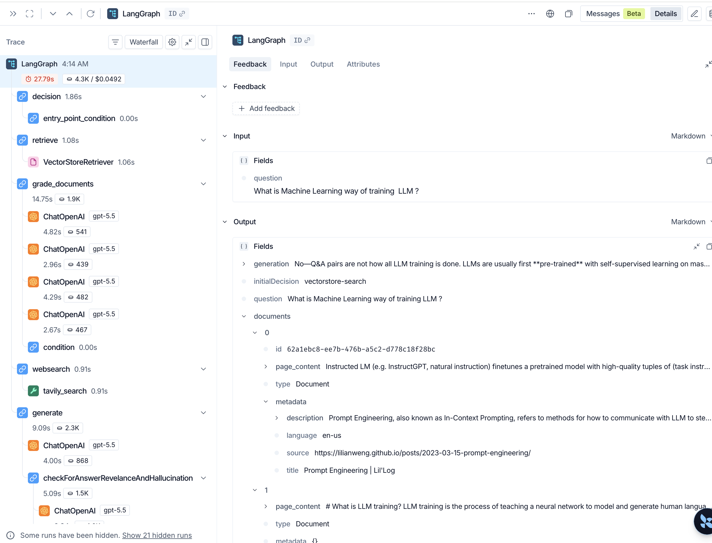
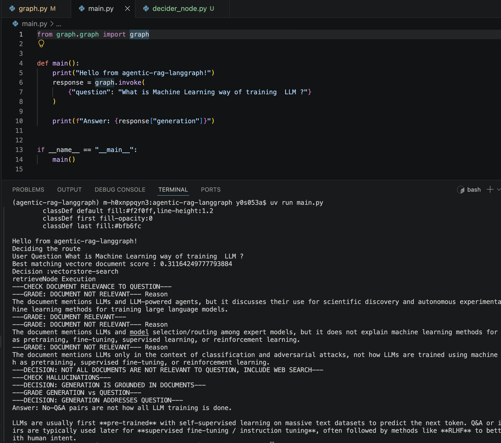
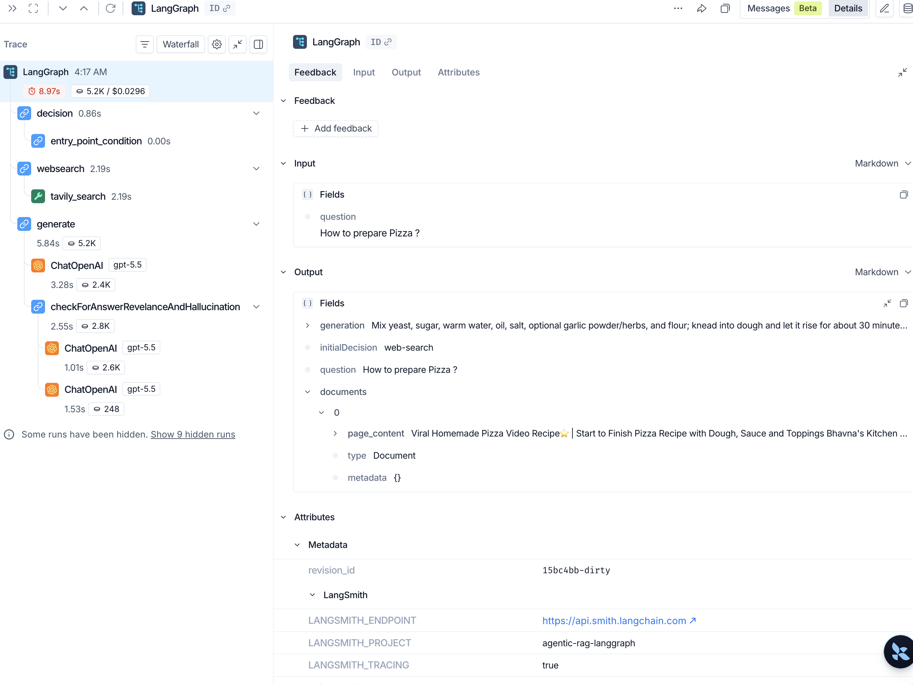
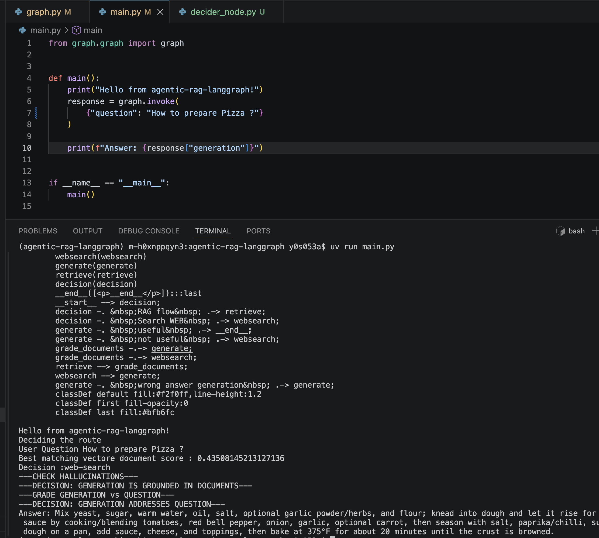

# Agentic RAG with LangGraph

This project implements an adaptive Retrieval-Augmented Generation flow using LangGraph.

Instead of always doing one fixed pipeline, the graph decides between:

1. Vector store first (RAG path), or
2. Direct web search first

Then it validates relevance, generates an answer, checks hallucination risk, and can loop for retries.

The goal is to improve answer quality by combining:
- Local knowledge from Chroma vector store
- External knowledge from Tavily web search
- LLM-based graders for relevance and grounding checks
---

## Agent Flow


## Ingestion

The ingestion pipeline collects content from three source articles, splits the text into chunks, generates embeddings, and stores them in Chroma for retrieval during RAG.

#### Source articles
- [LLM Powered Autonomous Agents](https://lilianweng.github.io/posts/2023-06-23-agent/)
- [Prompt Engineering](https://lilianweng.github.io/posts/2023-03-15-prompt-engineering/)
- [Adversarial Attacks on LLMs](https://lilianweng.github.io/posts/2023-10-25-adv-attack-llm/)

#### What happens in ingestion
1. Load web documents from the URLs above.
2. Split documents into 500-character chunks (no overlap).
3. Create embeddings using OpenAI embeddings.
4. Persist vectors to Chroma:
   - Collection: index-rag-chroma
   - Storage path: .chroma_db

---

## Retrieval


## Core graph state

The graph carries a shared state object with these fields:

- question: User query
- generation: Final or intermediate answer text from the generator
- web_search: Boolean flag that indicates if web search should be used
- documents: Retrieved evidence documents used as context
- initialDecision: First route decision, either vectorstore-search or web-search

---

## Nodes and their responsibility

### 1) Decision node

Purpose:
- Chooses the starting route based on vector similarity score.

Logic:
- Runs top-1 similarity search against vector store.
- Uses threshold 0.35.
- If best score is below 0.35, route to vectorstore-search.
- Otherwise route to web-search.

Why:
- Fast way to detect whether local indexed knowledge is likely enough.

---

### 2) Retrieve node

Purpose:
- Pulls candidate documents from Chroma retriever.

Logic:
- Uses the question from state.
- Invokes retriever.
- Stores retrieved docs in documents.

---

### 3) Grade documents node

Purpose:
- Filters retrieved documents by relevance to the question.

Logic:
- Runs an LLM retrieval grader per document.
- Keeps only docs graded relevant.
- If any document is graded not relevant, sets web_search to true.

Why:
- Avoids passing weak/noisy context directly to generation.
- Triggers web augmentation when retrieval quality is mixed.

---

### 4) Web search node

Purpose:
- Augments context with current external information.

Logic:
- Calls Tavily search (max 3 results).
- Concatenates result content.
- Wraps combined text as one document.
- Appends it to existing filtered docs if present; otherwise creates a new docs list.

Why:
- Adds fallback knowledge when vector retrieval is weak or incomplete.

---

### 5) Generate node

Purpose:
- Produces answer from question + combined context.

Logic:
- Joins all document text into one context string.
- Uses a pulled RAG prompt and ChatOpenAI model.
- Writes output into generation.

---

## Validation graders after generation

### Hallucination grader

Checks whether generated answer is grounded in provided documents.

- yes: answer is supported by context
- no: answer is not grounded and should be regenerated

### Answer relevance grader

Runs only if hallucination check passes.
Checks whether generated answer actually addresses the user question.

- true: useful answer
- false: not useful, needs new context path

---

## Routing logic in plain language

1. Start at Decision.
2. If local vector match is strong, go Retrieve.
3. Otherwise go Web Search.
4. If in Retrieve path, run document grading.
5. If grading says web_search is true, go Web Search.
6. Otherwise go Generate directly.
7. After Generate:
   - If grounded and question-related: finish.
   - If grounded but not question-related: go Web Search, then Generate again.
   - If not grounded: regenerate directly.

---

## End-to-end flow summary

### Path A: Good vector match

Decision -> Retrieve -> Grade Documents -> Generate -> Quality checks -> End

### Path B: Weak vector match

Decision -> Web Search -> Generate -> Quality checks -> End or retry

### Path C: Mixed retrieval quality

Decision -> Retrieve -> Grade Documents flags web_search -> Web Search -> Generate -> Quality checks

---

## Why this architecture is useful

- Adaptive retrieval strategy: not locked to one source.
- Better context quality: relevance filter before generation.
- Better answer trust: grounding check catches unsupported outputs.
- Recovery loops: retries and web augmentation improve final usefulness.

---

## Data and model dependencies

- Vector DB: Chroma, persisted at .chroma_db
- Embeddings: OpenAIEmbeddings
- LLM: ChatOpenAI model gpt-5.5
- Web retrieval: Tavily search API
- Prompt source: LangSmith public RAG prompt pull

---


## Execution

```
uv run main.py 

```

## Results

### Initial Decision = RAG
---

######  Langsmith trace
https://smith.langchain.com/public/9d2cbe36-4395-4149-9958-ba30ce3d5289/r/019f490d-e1bb-7da2-8726-f719c50706a3



###### logs


---


### Initial  Decision = Web Search
---

###### Langsmith trace
https://smith.langchain.com/public/7b09fa09-0791-4158-bc76-331a1519807f/r/019f4910-5291-7f40-9f7c-aaa9f8de468b


###### logs

